# 面试查漏补缺

## 一、C语言基础

### 1.整型类型：

i386

~~~c
char:                 1 byte		0~127 
signed char:          1 byte		-127~127 
unsigned char:        1 byte		0~255 
short int:            2 byte		-32767~32767 
unsigned short int:   2 byte		0~65535 
int:                  4 byte		-2147483648~2147483647 
unsigned int:         4 byte		
long:                 4 byte		
unsigned long:        4 byte		 
~~~

### 2.字面值:

~~~c
a、123、0123、0xff
~~~

### 3.命名常量：
与普通变量相似，区别在于，当它被初始化以后，它的值不能改变。

~~~C
const int a = 10;
~~~

### 4.枚举类型：
值为符号常量，而不是字面值常量。但其实也是**以整型存储。**

~~~c
声明了一个类型：
enum Jar_type {CUP,PINT,QUART};

(gdb) p sizeof(enum Jar_type)//一直是4，和有几个符号无关
$1 = 4

声明该类型的变量：
enum Jar_type milk_jug;
enum Jar_type milk_jug,gas_can;
~~~


### 5.浮点类型：
由图所示，大体可知道，不像整型那样，一个数由所有的位或者符号位+全部的数据位构成，其存储字被分为很多部分，所以浮点数的表示比整形复杂多了。

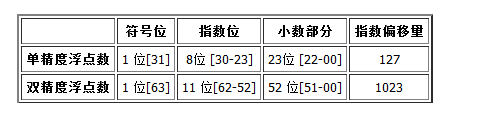

~~~c
float:                4 byte
double:               8 byte
long double:          12 byte
~~~


### 6.字符串常量和指针

由下，可知字符常量定义后，它在内存中的某个位置中。

下图，gdb打印的p2的地址，即，是一个指向大小为10的char类型的数组指针。

~~~c
void pointerwithstring()
{
	char *p1 = "abascklasmnc";//使用字符串常量“abascklasmnc”的第一个字符的地址给指针p初始化
    
	//p1[3] = 'A';//修改字符常量，引起段错误
    
	char p2[10] = "abascklasmnc";//注意，这并不是上面的字符串常量给字符数组赋值，而是字符数组的初始化。
	
	printf("addr p1:0x%x p2:0x%x\n",p1,p2);
	printf("str p1:%s,p2:%s\n",p1,p2);
}

#if 0
root@ubuntu:/home/zyb/CODE/LINUX_C/BASE# ./print_c
addr p1:0x80485da p2:0xbffafb42
str p1:abascklasmnc,p2:abascklasm

(gdb) p &p2
$1 = (char (*)[10]) 0xbffff5b2

#endif 
~~~


### 7. typedef :
为各种数据类型定义新名字

~~~c
typedef char *ptr_tocahr 
将标识符声明为指向字符的指针类型的新名字。
~~~


#### #define:
简单替换它定义的字符串，一般使用它的坑是使用#define来替换指针类型，定义时出现的错误

~~~c
#define ptr_to_char char *
ptr_to_char a,b;//a为指向字符的指针，而b为一个字符变量。
~~~


### 8. const

作用于变量时表示声明一个常量，所以它所修饰的常量必须初始化，因为他后续不能修改。

~~~c
const int a = 10; <==> int const a = 10;
~~~


#### 8.1 const修饰变量和指针的各种变体

| 形式 | 含义 |
| ---- | ---- |
| int \* | a pointer to int   |
|int const\* | a pointer to const int |
|int \*const | a const pointer to int |
|int const\* const | a const pointer to const int                 |
|int \*\* const | a const pointer to pointer to an int.           |
|int \* const | a pointer to const pointer to an int.           |
|int const \*\* | a pointer to a pointer to a const int.          |
|int \* const \* const | a const pointer to a const pointer to an int. |

发现怎么读了吗？

**第一步，忽略变量名**  ==========>>> 比如 int const *ptr  忽略为  int const *

**第二步，从右往左读 ** ==========>>> 比如 int const *，从右到左：pointer 、const int   =======>   a pointer to a const int.   =======>   一个指针，指向常量。=======>    一个指向常量的指针。

**既，先按照结构写出英文，再翻译成中文**


### 9.标识符的作用域

编译器可以确认四种不同类型的作用域：

**（1）文件作用域: **任何在所有代码块之外声明的标识符都具有文件作用域，它表示这些标识符从它们的声明之处直到它所在的源文件结尾处都是可以访问的。如定义的全局变量、函数.如以下文件：test.h

~~~c
#ifdef __TEST__H__
#define __TEST__H__

int g_count = 0;

void test()
{
    printf("%d\n",g_count);
}

#endif 
~~~

**（2）函数作用域:**

函数作用域只适用于语句标签，语句标签用于goto语句.也就是一个函数中的所有语句标签必须唯一。

**（3）代码块作用:**

~~~c
{//一个代码库作用域
    int a;
    int b;
}

//代码块的嵌套
{//上层作用域A
    
    int a;
    int b;
    int f;
    {//作用域B
    	  int f;//此时内部的代码块中的f将隐藏上层代码块的变量f,所以此时不能在B中访问A中的f
    }
}


void scope_test()
{
	{
		int a = 10;
		int b = 20;
	}
	
	printf("%d\n",a);//ERROR
}

#if 0
Scope.c: In function ‘scope_test’:
Scope.c:10:16: error: ‘a’ undeclared (first use in this function)
  printf("%d\n",a);
#endif


~~~


**（4）原型作用域:** 我理解的就是函数形参


### 10.链接属性：
相同的标识符出现在不同的源文件中时，它的属性如何声明会影响到他的链接属性

**（1）没有链接属性的标识符被当做单独的个体，也就是说该标识符的多个声明被当作独立不同的实体**

**（2）属于intern链接属性的标识符在同一个源文件内的所有声明都指向同一个实体，位于不同源文件的多个声明则分属不同的实体**

**（3）属于extern链接属性的标识符不论声明多少次、位于几个源文件中，都表示同一个实体**


### 11.存储类型：存储变量值的内存类型

**（1）** 静态变量：任何在代码块之外声明的变量，或者使用staic修饰的代码块内的变量的存放位置

**（2）**自动变量：代码块内且未用static修饰的变量。(就是栈区变量）

​				a. 在程序执行到声明自动变量的代码块时，自动变量才被创建。

​				b. 当程序的执行流离开该代码块时，这些自动变量便自行销毁

​				c. 如果该代码块被数次执行，比如一个函数被反复调用，这些自动变量每次都将重新创建


### 12.结构体声明和对齐注意事项

#### 结构体声明

~~~c
struct {
    int a;
    char b;
    float c;
}x,y[10],*z;  //这是创建变量x、y、z


struct tag_name{
    int a;
    char b;
    float c;
};
通过标签 tag_name,这个标签标表明一个特定的结构体，其名为 struct tag_name
    
也可通过typedef来创建
typedef struct{
    int a;
    char b;
    float c;
}new_name;

通过typedef为结构体变量定义新名称。
~~~


#### 结构体的存储分配

（1）编译器按照成员列表的顺序，一个一个的给每个成员分配内存，只有当存储成员需要满足正确的边界对齐要求时，成员之间才可能出现用于填充的额外内存空间。

（2）系统禁止编译器在一个结构的起始位置，跳过几个字节来满足边界对其要求。因此所有结构的起始存储位置必须并且要求最严格的数据类型所要求的位置

~~~c
#include <stdio.h>

struct{
	char a;
	int  b;
	char c;
}st1_mem_info;

struct {
	int  b;
	char a;
	char c;
}st2_mem_info;

struct {
	double d; 
	int  b;
	char a;
	char c;
}st3_mem_info;

struct {
	char a;
	char c;
	int  b;
}st4_mem_info;

struct {
	char a;
	char b;
	char c ;
}st5_mem_info;

int main()
{
	st1_mem_info;
	st2_mem_info;

	printf("st1_mem_info:\n");
	printf("a:0x%x 		b:0x%x 		c:0x%x 		size: %d\n",
	&st1_mem_info.a,&st1_mem_info.b,&st1_mem_info.c,sizeof(st1_mem_info));
	
	printf("\nst2_mem_info:\n");
	printf("a:0x%x 		b:0x%x 		c:0x%x 		size: %d\n",
	&st2_mem_info.a,&st2_mem_info.b,&st2_mem_info.c,sizeof(st2_mem_info));
	
	printf("\nst3_mem_info:\n");
	printf("a:0x%x 		b:0x%x 		c:0x%x 		d:0x%x 		size: %d\n",
	&st3_mem_info.a,&st3_mem_info.b,&st3_mem_info.c,&st3_mem_info.d,sizeof(st3_mem_info));
	
	printf("\nst4_mem_info:\n");
	printf("a:0x%x 		b:0x%x 		c:0x%x 		size: %d\n",
	&st4_mem_info.a,&st4_mem_info.b,&st4_mem_info.c,sizeof(st4_mem_info));
	
	printf("\nst5_mem_info:\n");
	printf("a:0x%x 		b:0x%x 		c:0x%x 		size: %d\n",
	&st5_mem_info.a,&st5_mem_info.b,&st5_mem_info.c,sizeof(st5_mem_info));
	
	return 0;
}
~~~

打印如下：

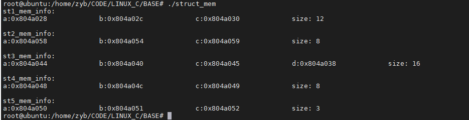


如上，对于结构体st1_mem_info，成员顺序为char a;int  b;char c;  a的起始位置距b的起始位置相差4，b 和c同理。内存布局如下：

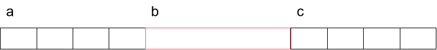


对于st2_mem_info，成员顺序为int  b;char a; char c;，b与a之间差4，这是sizeof(b)的大小，而a与c之间的大小，为sizeof(char) == 1。

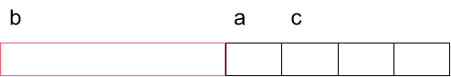

**然而，这是为什么呢？为什么会是这样的布局呢？为什么？不能光靠死记硬背啊！这是为什么？？？**

因为，这是和操作系统访问内存空间紧密相关，和系统架构有关。

当一个系统的机器字长（**机器字长是指计算机进行一次整数运算所能处理的二进制数据的位数**）为32位时，**那么在该架构下，操作系统要访问一个整数，这个整数的起始地址必须能够被4整除**。也即是为**机器字长的字节数**的整数倍。所以我们定义结构体变量，为其内部声明几个变量，我们如果不知道也不考虑上述架构的特点而随意定义，那么编译器必将为我们在分配内存的时候考虑到，不然我们定义的该结构体中的变量就不能被正常访问。

所以，以后面试，再出现这种题，**首先，看面试官给的结构体，然后，把每个变量的大小写出来，然后依据空间上的顺序，小于4的补上差的字节数，为4的倍数的变量其大小不变，最后累加，就能得到正确的结构体大小。**


### 13. 联合体

~~~c
#include <stdio.h>
union {
	float f;
	int i;
}fi;

int main()
{
	fi.f = 3.14159;
	printf("fi:\n");
	printf("f:0x%x val:%f 	i:0x%x  val:%d\n",&fi.f,fi.f,&fi.i,fi.i);
	
	return 0;
}
~~~

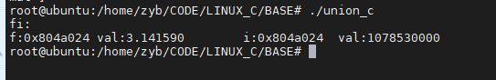


如上，成员f和i都指向同一个地址，联合体的真相就是，它有多少个成员无所谓，但是它只有一块内存，用来解释所有的成员，当你使用int成员时，就将这块内存按照int型来表示，同理，char、float等也是，由此可知，**这块内存一定要足够大到能够表示其最大的成员**，所以联合体的大小由最大的成员所占的内存来决定。


### 14. 实现memcpy

~~~c
void *memcpy(void *dst, const void *src, size_t len)
~~~

#### 考点1：参数合法性

~~~c
if (dst == NULL || src == NULL)
{
    return NULL;
}
~~~

#### 考点2：内存区域重叠

~~~c
if (dst <= src || (char *)dst >= (char *)src+len)
{
    while (len--)
    {
        *(char *)dst = (*(char *)src);
        dst = (char *)dst+1;//注意偏移单位，先转换为
    }
}
~~~


（1）dst <=src-len

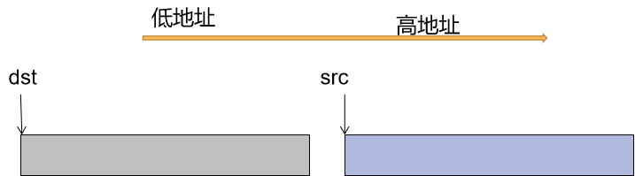

（2）dst > src-len && dst <= src

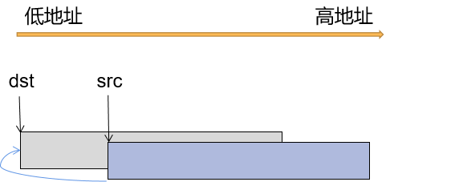


对于（1）、（2），dst <= src：由于dst在src之前，dst的区域被从低到高赋值，在（2）中会发生内存覆盖。而从低地址开始拷贝，保证了src可能会被dst覆盖的存储区域,都是先将此区域的值拷贝给dst后，再被覆盖。这种实现，**能保证完成拷贝的功能，但是会破坏src的原始数据**。


（3）dst >= src+len

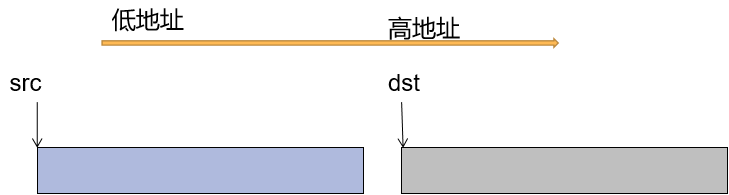


此种情形满足：(char *)dst >= (char *)src+len：dst在src+len之后的区域，所以**能完成拷贝功能，且不会对src的内存进行破坏。**

所以，（1）、（2）、（3）都是可以从低地址开始拷贝的,代码如下。

~~~c
if(dst <= src || (char *)dst >= (char *)src + len)
{
    while(len--)
    {
        *(char *)dst = *(char *)src;
        dst = (char *)dst + 1;
        src = (char *)src + 1;
    }
}
~~~


(4) dst > src && dst < src+len;即，dst位于src的内存区域中。

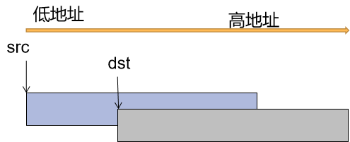

对于（4），**若从低地址拷贝，则一定会破坏src的和dst重叠的内存且待拷贝的区域**，这样后续拷贝的数据将彻底错误。所以，针对这种情形，一定不能从低地址开始拷贝，**必须从高地址开始拷贝**。

~~~c
{
    while(len--)
    {
        *(char *)dst[len-1] = *(char *)src[len-1];
    }
}
~~~


这种情形，**会破坏src的部分数据。**


### 15.预编译头

；待补充

### 16. free()内存

**经典面试题：free只传入一个void *指针，它怎么知道该释放多大的内存？**

google一下，原来我们调用malloc分配的内存其实是比我们想要的内存大一点的，它多了一个该块内存的信息头.

如下：

​	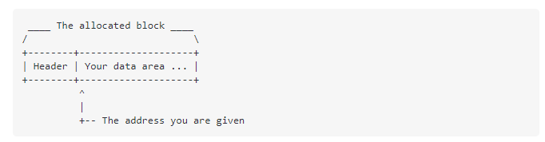

上图清晰明了，malloc分配的内存其实比我们传入的大小信息多那么一点，这多出的信息是为了存储分配的内存的大小等信息，当调用free(p)时，会根据p的地址前的这段信息知道这块待释放内存的大小，并进行释放。


### 17+.数据结构

#### 1.单向及单向循环链表：

**(1): 最后一个结点的指针域指向头结点**

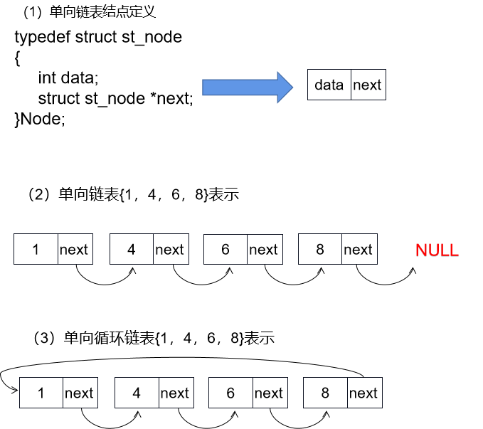

#### 2.双向及双向循环链表：

**(1)  结点的后继指针域指向下一个结点，前驱指针域指向前一个结点。**
**(2)  尾结点的后继指针指向头结点。**
**(3)  头结点的前驱指针指向尾结点。**


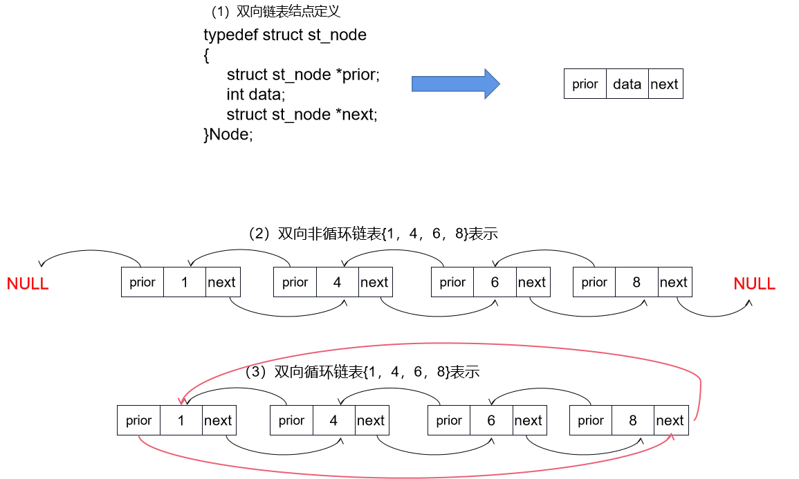

~~~c
//使用双向循环链表实现队列的操作
#include <stdio.h>
#include <stdlib.h>
#include <string.h>
#include <assert.h>

#define bool int
#define false -1
#define true 1


typedef struct st_node
{
    struct st_node *prior;
    int pnode;
    struct st_node *next;
}que_node;

typedef struct st_queue
{
    que_node *phead;
    int size;
}queue;

que_node* make_quenode(int pnode)
{
    que_node* ptmp = (que_node *)malloc(sizeof(que_node));
    memset(ptmp,0,sizeof(que_node));

    ptmp->pnode = pnode;
    ptmp->prior = ptmp->next = ptmp;
    return ptmp;
}

queue *pg_queue = NULL;

void init_queue()
{
    pg_queue = (queue *)malloc(sizeof(queue));
    memset(pg_queue,0,sizeof(queue));
}

void push_queue(int pnode)
{
    que_node* ptmp = make_quenode(pnode);

    if (pg_queue->phead == NULL)
    {
        pg_queue->phead = ptmp;
    }
    else 
    {//尾插入一个双向循环链表
        printf("%d\n",ptmp->pnode);
        ptmp->prior = pg_queue->phead->prior;
        ptmp->next = pg_queue->phead;
        pg_queue->phead->prior->next = ptmp;
        pg_queue->phead->prior = ptmp;
    }

    pg_queue->size += 1;
}

que_node* pop_queue()
{
    que_node *ptmp = NULL;
    if (pg_queue->size == 0)
    {
        return ptmp;
    }
	
	ptmp = pg_queue->phead;
	
	if (pg_queue->size == 1)
	{
		pg_queue->phead = NULL;
		pg_queue->size -= 1;
		return ptmp;
	}
	
    ptmp->prior->next = ptmp->next;
    ptmp->next->prior = ptmp->prior;
    pg_queue->phead = ptmp->next;

    ptmp->next = NULL;

    pg_queue->size -= 1;
    return ptmp;
}


bool empty_queue()
{
    if (pg_queue->size == 0)
    {
        return true;
    }

    return false;
}

int size_queue()
{
    return pg_queue->size;
}

void free_queue()
{
    assert(pg_queue->size == 0);
    free(pg_queue);
}

int main()
{
	init_queue();
	que_node *ptmp = NULL;
	
	push_queue(1);
	push_queue(2);
	push_queue(3);
	push_queue(4);
	push_queue(5);
	push_queue(6);
	push_queue(7);
	push_queue(8);
	push_queue(9);
	push_queue(10);
	push_queue(11);
	push_queue(12);
	push_queue(13);
	push_queue(14);
	push_queue(15);
	push_queue(16);
	push_queue(17);
	
	printf("pop:\n\n");
	while (empty_queue() == false)
	{
		ptmp = pop_queue();
		printf("%d\n",ptmp->pnode);
		free(ptmp);
		ptmp = NULL;
	}
	
	free_queue();
	return 0;
}
~~~


## 二、C++语言
### 1. C++基础

#### 1.常量表达式

值不会改变并且**在编译过程就能得到计算结果**的表达式。

~~~c
int const a = 10;//常量表达式
int const a = getchar();//非常量表达式，因为a要运行时才能得到其值
~~~

#### 2. constexpr

c++11 允许将变量声明为constexpr类型,以便由编译器来验证**变量的值是否是一个常量表达式。**

**constexpr修饰指针**：constexpr如果修饰指针，和const是不一样的，它仅对指针有效，与指针所指的对象无关。

~~~c
constexpr int *p = nullptr;//不能按照之前总结的const的从右往左读的方式,此处的constexpr修饰指针为常量指针
~~~

#### 3. auto

auto是类型说明符,用它就能让编译器替我们去分析表达式所属的类型。

#### 4. decltype 

有时候我们需要从表达式得到变量的类型，但是我们不想要用表达出来初始化变量。

~~~c
#include <iostream>
using namespace std;

char get_char()
{
	return 'a';
}

int main()
{
	decltype(get_char()) character;
	cout<<"value:"<<character<<endl;
	cout<<"size:"<<sizeof(character)<<endl;
	return 0;
}
~~~

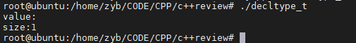


**(1) 如果表达式的内容是解引用操作，则decltype将得到引用类型**

**(2) decltype的表达式如果是加上了括号的变量，结果将是引用**

#### 5.顶层和底层const

顶层const：表示const修饰的变量本身是个常量，即，顶层const作用于**对象本身。**

~~~c
int a = 0;
int *const p = &a;//顶层const,因为const修饰的p这个对象
~~~


底层const：一般与指针和引用等复合类型的基本类型部分相关，表示**指针或引用所指的对象是一个常量。**

~~~c
const int a = 10;
int const *p = &a;//底层const,因为const修饰p所指向的变量
~~~


~~~c
int *const = int * [OK]
int*  = const int* [ERR]
~~~


~~~CQL
#include <iostream>
int main()
{
	int c = 10;
	const int *d = &c;	
	int *e = d;//error
    return 0;
}
~~~

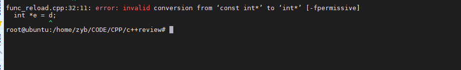


#### 6. 命名空间和using声明

**（1）std::cin ========> 作用域操作符::,告知编译器,去左边的命名空间std寻找右侧的名字cin**

**（2）可以通过using声明一个命名空间，来表明我们当前文件使用的一些符号可以去那个命名空间中寻找。**

~~~c
using namespace std;//在本文件中声明了命名空间std
~~~


####  6.1 using实现类型别名

~~~c
using Integer = int; 
~~~


#### 7. string

**string不像C语言一样以'\0'表示结尾**

~~~c
string s1;
string s2 = s1;
string s3(s2);
string s3 = "hiya";
string s4("hiya");//不拷贝末尾的'\0'
string s4(10,c);
~~~

string的部分操作：

| 操作 | 含义 |
| :-- | -- |
| s. empty() | s为空返回true |
| s. size() | 返回s中的**字符个数**，返回类型为string::size_type |
| s[n] | 返回s中第n个字符的**引用** |
| s1 + s2 | 返回s1与s2连接后的结果 |
| s1+=s2 | 同上 |
| s.c_str() | 转化为C语言的字符串 |
| string& insert(size_t pos,const string& str); | z在pos位置插入str |
| string& erase (size_t pos = 0, size_t len = npos); | 删除 string 中的一个子字符串 |
| string substr (size_t pos = 0, size_t len = npos) const; | 从 string 字符串中提取子字符串 |
| size_t find (const string& str, size_t pos = 0) const;<br/>size_t find (const char* s, size_t pos = 0) const; | 在 string 字符串的pos位置开始，查找子字符串出现的位置 |
| s1.find_first_of(s2); | 找到s2在s1中首次出现的位置 |


~~~c
#include <cstdio>
#include <string>
#include <iostream>

using namespace std;

void print_pointer()
{
	char *p1 = "abcdefghi";
	string p2 = "abcdefghi";
	char *p3 = "abcdefghi";
	
	cout<<(void *)p1<<endl;
	cout<<&p2<<endl;
	cout<<(void *)p3<<endl;
	
	cout<<endl<<endl;
	
	printf("0x%x\n",p1);
	printf("0x%x\n",&p2);
	printf("0x%x\n",p3);
}

void print_string(string &str)
{
	cout<<(void *)&str<<endl;
	cout<<endl;
	
	for (auto &c:str)//c为引用
	{
		cout<<(void *)&c<<endl;
	}
	
	cout<<endl<<endl;
	
	for (auto d:str)//d为变量
	{
		cout<<(void *)&d<<endl;
	}
}

int main()
{
	string str = "abcdefghi";
	print_string(str);
	return 0;
}
~~~


#### 8. 初始化

##### 1.变量的初始化方式

~~~c
int a = 0;
int a = {0};
int a{0};//列表初始化
int a(0);
~~~


##### 2.列表初始化

~~~c
int b = 0;
int a{b};//列表初始化
~~~

**注意！如果我们使用列表初始化且初始值存在丢失信息的风险，则编译器将报错**

~~~c
#include <iostream>
using namespace std;
int main()
{
	long double ld = 3.1415926536;
	int a{ld};
	cout<<a<<endl;	
	return 0;
}
~~~

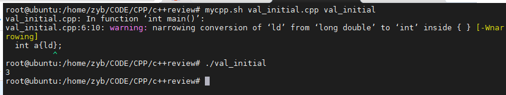

我的g++没报错，但是有编译警告


#### 9. 显示转换

**命名的强制类型转换：**有我们希望显示的将对象强制转换成另外一种类型，所以我们需要显示转换。

~~~c
cast-name<type> (expression)
~~~

##### 1. static_cast

使用static_cast等效于进行C类型的值的强制转换

##### 2. dynamic_cast

**dynamic_cast <新类型>（表达式）**

**将基本类型指针转换（向下转换）为派生类型的指针或引用。**

错误输入时会产生nullptr。

##### 3. const_cast

**（1）const_cast作用于底层const对象，用于修改其const属性**

**（2）若是将const修改为非const,编译器就不再阻止我们修改其值,但修改这个动作是未定义的**

~~~c
void const_cast_t()
{
	int a = 10;
	const int b = 20;
    
	//int *p = &b;//【error】: const int * to int *
	
    const int *p1 = &b;//【ok】
	
    int *p = const_cast<int *>(&b);//【OK】 去掉了&b的const属性
	*p = 560;
	cout<<b<<endl;//输出依旧是20，说明将const通过const_cast转换为非const后，对其修改是未定义的。
	
	//int *const p2 = &b;//【error】： p2是常量，而p2指向的int是非常量，b是常量
	//这个等价于: int *p = &b;//【error】
}
~~~


###### 3.1 const int \*和int \*的转换

c和c++的不同的，具体如下：

~~~c
#include <stdio.h>
int main()
{
	int const a = 10;
	int *p = &a;
	return 0;
}
~~~

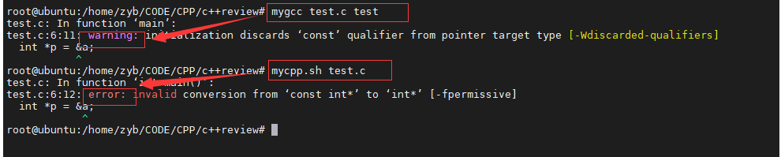

由上可知，对于c,将const int\*传递给int\*,gcc编译器会发出警告,而对于**g++则直接报错**。


##### 4. reinterpret_cast

**可以将一个指针类型转化为其他的不相关的指针类型**，这种用法极不安全，你一定要确切知道自己在干啥！

```c
Convert anything to anything--used by lunatics.
```

#### 10. 引用

##### 1.引用的说明

1. **引用必须被初始化**
2. **字面值不可以用来初始化非常量引用，如果是常量引用的话就可以。**
3. **引用变量是它所引用变量的别名，所以引用的地址和它所引用的变量的地址相同**
4. **返回引用的函数是左值**

   

##### 2. 使用引用避免拷贝

特别是传递大对象参数的时候

##### 3. 常量引用

~~~c
const int &a = 42;
~~~


#### 11. initializer_list

这是一个类模板，用于表示某种特定类型的值的数组。这种方案是为了达到真正的可变参数，既，不用像c函数传入参数的个数的参数。如下代码，当列表中的元素变化后，print_var函数不需要知道。

~~~c
#include <iostream>
#include <initializer_list>

using namespace std;
void print_var(initializer_list<int> lst)
{
	cout<<(void *)&lst<<endl;
	
	cout<<lst.size()<<endl<<endl;
	
	for (auto a:lst)
	{
		cout<<a<<endl;
	}
}

void initializer_list_test()
{
	initializer_list<int> lst{1,2,3,4,5,6};	
	
	initializer_list<int> lst2{1,2,3,4,5,6,7,9,10,1,2,3,1234,123451234};	
	//print_var(lst);
	print_var(lst2);
}

int main()
{
	initializer_list_test();
	
	return 0;
}
~~~

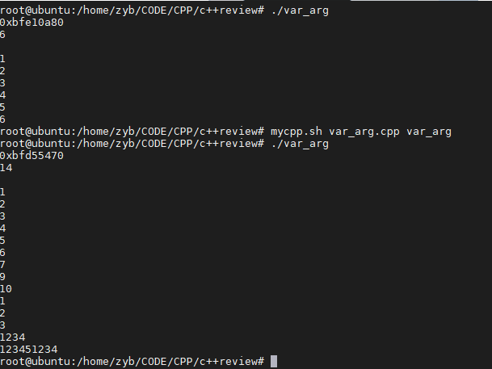


#### 12. 返回类类型的函数和调用运算符

~~~c
auto sz = shorterString(s1,s2).size();
~~~

#### 13. 为返回类型是非常量引用的函数的结果赋值

~~~c
#include <iostream>

using namespace std;

char &get_val(string &str,int idx)
{
    return str[idx];
}

char *get_val_c(const char *p,int idx)
{
	return (char *)&p[idx];
}

int main()
{
    string s("a value");
    cout<<s<<endl;
    get_val(s,0) = 'A';
    cout<<s<<endl<<endl<<endl;
    
    #if 0 这充分说明引用的本质就是它引用的变量的别名。
	get_val_c(s.c_str(),2) = 'B';
	return_left_refrence.cpp: In function ‘int main()’:
	return_left_refrence.cpp:22:25: error: lvalue required as left operand of assignment
    get_val_c(s.c_str(),2) = 'B';
	cout<<s<<endl<<endl<<endl;
    #endif 
    
    return 0;
}
~~~

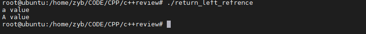


#### 14. 列表初始化返回值

c++11，函数可以返回花括号包围的值的列表，此返回的列表也用来表示对**函数返回的临时量**进行初始化

~~~c
#include <iostream>
#include <vector>
using namespace std;

vector<string> process()
{
	return {"watermelon","banana","apple"};
}

int main()
{
    vector<string> vstr = process();
	cout<<vstr.size()<<endl<<endl<<endl;
	for (auto v:vstr)
	{
		cout<<(void *)&v<<":"<<v<<endl;
	}
	
    return 0;
}
~~~


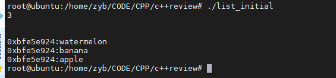


#### 15. 函数重载

如果**同一作用域内**的几个函数**名字相同但参数列表不同**我们称之为**重载函数**

（函数重载机制只看参数列表和个数，其余的一切不是重载机制的依据）


**错误的认为返回类型不同也是重载的示例**

~~~c
#include <iostream>
using namespace std;
void printstr(char *p)
{
	cout<<p<<endl;
}

int printstr(char *p)
{
	cout<<p<<endl;
	return 0;
}

int main()
{
	
    return 0;
}
~~~

编译错误如下：

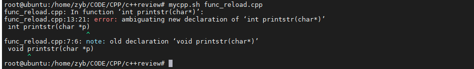


**正确的简单的示例**

~~~c
#include <iostream>
using namespace std;
void printstr(char *p)
{
	cout<<"arg type: char *"<<endl;
	cout<<p<<endl<<endl;
}

void printstr(string &p)
{
	cout<<"arg type: string &"<<endl;
	cout<<p<<endl<<endl;
}

int main()
{
	string a("asdknvcaslkcmasc");
	
	printstr("abcd");
	printstr(a);
    return 0;
}
~~~

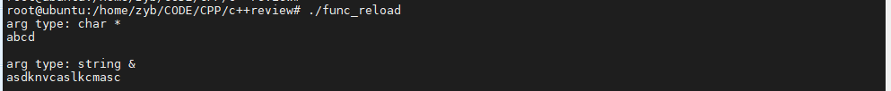

#### 16. 重载和const形参

之前我们在顶层和底层const中说了，顶层const: int *const  = int *是合法的，所以，用到函数重载这里的话，

Record lookup(string *p) 和Record lookup(string *const p)是同一个函数，不属于重载。

~~~c
void printstr(string *const p)
{
	cout<<"const arg type: string &"<<endl;
	cout<<p<<endl<<endl;
}

void printstr(string *p)
{
	cout<<"arg type: string &"<<endl;
	cout<<p<<endl<<endl;
}
~~~

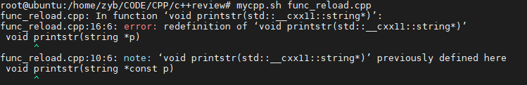


#### 17. 函数重载如何实现

**函数匹配** ：即，把函数调用和一组重载函数中的某一个关联起来的过程，也称为**重载确定**。

编译器将调用的实参与重载集合中的每一个函数的形参比较，然后根据比较的结果确定调用哪一个函数。


#### 18. 默认实参定义及特性

**某些函数有这样一种形参，在函数的很多次调用中它们都被赋予同一个值，我们把这个反复出现的值称为函数的默认实参**

**（1）调用含有默认实参的函数时，可以包含该实参，也可以省略该实参**。
**（2）默认实参作为形参的初始值出现在形参列表中**。
**（3）一旦某个形参被赋予了默认值，它后面的所有形参都必须有默认值**。
**（4）在给定的作用域中，一个形参只能被赋予一次默认实参，换句话说，函数的后续声明，只能为之前的那些没有默认值的形参添加默认实参**


#### 19. 内联函数和constexptr

##### 19.1 为什么我们要用内联函数？

我们使用函数，是因为函数能使的我们写代码的时候少写一些重复代码，函数能够将大量的相同的过程抽象成一个可复用的过程，但是函数的调用开销是比较大的，综合它的优缺点，所以我们使用内联函数。**即抹掉了函数调用的开销，又能使得重复过程的复用。**由此也可以看出，内联函数适用于比较小的过程。

##### 19.2  constexptr 函数

**(1) 函数的返回类型及其所有形参的类型都得是字面值的类型** 

**(2) 函数体中有且必须只有一条return 语句**

~~~c
constexptr int new_sz {return 42;}
constexptr int foo = new_sz();
~~~

#### 20. 函数指针

首先我们要明确函数，**函数的类型由它的返回类型和形参类型共同决定，与函数名无关。**

~~~c
#include <iostream>
#include <string>
#include <cstring>
using namespace std;

//定义一个函数指针
char *(*func)(int,char *);

char *getstring(int size,char *string)
{
	char *res = (char *)malloc(size+1);
	strncpy(res,string,size);
	res[size] = '\0';
	
	return res;
}

void func_test()
{
	func = getstring;//给该函数指针赋值
	
	char *res = func(strlen("aaaaa"),"aaaaa");
	
	cout<<res<<endl;
	free(res);
}

int main()
{
	func_test();
	return 0;
}
~~~

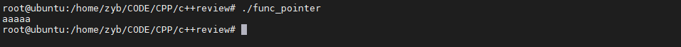

#### 21. 类

##### 1. this

this 是 C++中的一个关键字，也是一个 const 指针，**它指向当前对象**，通过它可以访问当前对象的所有成员。

##### 2. 修改this属性为const

~~~c
std::string isbn() const {return this->bookNo;}
~~~

const 的作用是修改隐式this指针的类型。

比如类A的对象a ，默认a的this 指针为 A *const ，修改为后为const A * const ;

##### 3. 常量成员函数

**紧跟在成员函数的参数列表后面的const表示this是一个指向常量的指针**,像这样使用const的成员函数被称为常量成员函数。


~~~c
#include <iostream>
#include <string>
#include <cstring>
using namespace std;

class Sales_data 
{
public:
	Sales_data(int arga){a = arga;}
	int a;
	Sales_data  &combine(const Sales_data &);
};

Sales_data  &Sales_data::combine(const Sales_data &rhs)
{
	a += rhs.a;
	cout<<"this :"<<this<<endl;
	return *this;
}

void class_test()
{
	Sales_data sobj(0);
	cout<<"sobj address: "<<(void *)&sobj<<endl<<endl;
	Sales_data sobj2(5);
	cout<<"sobj2 address: "<<(void *)&sobj2<<endl<<endl;
	sobj.combine(sobj2);
}

int main()
{
	class_test();
	return 0;
}
~~~

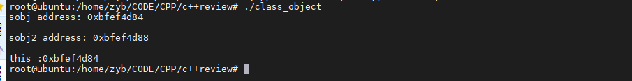


##### 4.空类的大小

~~~c
class empty
{
};

int main()
{
	cout<<sizeof(empty)<<endl;	
	return 0;
}
~~~

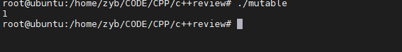


#### 22. 构造函数

构造函数的任务是初始化类对象的**数据成员**，无论何时只要类的对象被创建，就会执行构造函数。

##### 1. 构造函数不能声明为const的

**当我们创建一个对象时，直到构造函数完成初始化过程，对象才能真正取得其“常量”属性。因为，构造函数需要在构造过程中对该对象写入一些东西**。如果声明为const,那么表示这个对象是常量，不能修改，那么构造过程就无法进行。

##### 2. 合成默认构造函数

类通过一个特殊的构造函数来控制**默认初始化过程**，这个函数叫做默认构造函数。默认构造函数无需任何实参。

如果我们的类没有显示定义一个构造函数，那么编译器就会为我们隐式地定义一个默认构造函数。编译器所构造的构造函数又被称为**合成默认构造函数**

##### 3. =default

如果我们需要默认的行为,那么我们可以通过在参数列表的后面写上**=default**来**要求编译器生成构造函数**

##### 4. 构造函数初始值列表

~~~c
class Sales_data 
{
public:
	Sales_data(int arga) ：a(arga),str("default"){cout<<a<endl;}
	Sales_data(string& pstr):str(pstr),a(10) {cout<<str<<endl;}
    
	int a = 10;
	string str;
	Sales_data  &combine(const Sales_data &);
};
~~~

**作用：**负责为新创建的对象的一个或几个数据成员赋初值。

**没有出现在构造函数初始值列表中的成员，将通过相应的类内初始值初始化，或者执行默认初始化,且初始化顺序在构造函数执行之前**

~~~c
#include <iostream>
#include <string>
using namespace std;

class sequence
{
public:
	sequence(){cout<<a<<endl;}
private:
	int a = 10;
};

void initial_sequence_t()
{
	sequence sequence_t;
}

int main()
{
	initial_sequence_t();
	return 0;
}
~~~

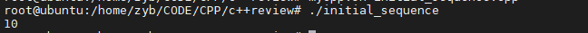

可以看到，在构造函数执行完成之前，a就为10，证明**这种情况成员变量的初始化是在构造函数之前的。**

又如下：

~~~c
#include <iostream>
#include <string>
using namespace std;

class sequence
{
public:
	sequence():a(a+1){cout<<a<<endl;}
	
private:
	int a = 10;
};

void initial_sequence_t()
{
	sequence sequence_t;
}

int main()
{
	initial_sequence_t();
	return 0;
}
~~~

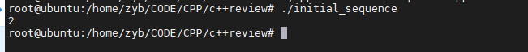


如上，a居然输出2，说明什么呢？**如果显示地初始化，那么初始化顺序还是以显式顺序为准**

**显示初始化和赋值初始化是两种情况，显示初始化直接初始化数据成员，而赋值，是初始化后再赋值，效率显示是不一样的。**


###### 1. 构造函数初始化顺序

**构造函数初始值列表只说明初始化成员的值，而不限定初始化的具体顺序。**


##### 5. 必须显示初始化的情况

若成员是**const、引用、或者属于某种未提供默认构造函数的类类型**，我们必须通过构造函数初始值列表为这些成员提供初始值。

##### 6. 委托构造函数

~~~c
#include <iostream>
#include <string>
using namespace std;

int sequence = 1;

class Sales_data{
public:
	Sales_data(string s,unsigned cnt,double price):bookNo(s),units_sold(cnt),revenue(cnt*price){cout<<"Sales_data(string s,unsigned cnt,double price):bookNo(s),units_sold(cnt),revenue(cnt*price) sequence:"<<sequence++<<endl;}
	
	Sales_data():Sales_data("",0,0){cout<<"Sales_data() sequence:"<<sequence++<<endl;}
	
	Sales_data(string s):Sales_data(s,0,0){cout<<"Sales_data(string s) sequence:"<<sequence++<<endl;}
	
	Sales_data(istream &is):Sales_data(){cout<<"Sales_data(istream &is) sequence:"<<sequence++<<endl;}
private:
	string bookNo;
	unsigned units_sold;
	double revenue;
};


int main()
{
	string str("aaa");
	Sales_data sdata(str);
	return 0;
}	
~~~

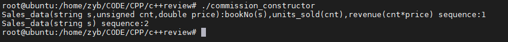

上图打印顺序，既为**委托构造函数的执行逻辑。**


##### 7. 转换构造函数

1. 如果构造函数**只接受一个实参**，则它实际上定义了**转化为此类类型的隐式转化机制**，我们把这种构造函数称作转换构造函数。

   ~~~c
   #include <iostream>
   #include <cstring>
   
   using namespace std;
   
   class Complex{
   public:
   	Complex(): m_real(0.0),m_imag(0.0){ }
   	Complex(double real,double imag):m_real(real),m_imag(imag){ }
   	Complex(double real): m_real(real),m_imag(0.0){}
   
   public:
   	friend Complex operator+(const Complex &A,const Complex &B);
   	
   public:
   	double real() const { return m_real; }
   	double imag() const { return m_imag; }
   	
   private:
   	double m_real;
   	double m_imag;
   };
   
   
   Complex operator+(const Complex &A, const Complex &B)
   {
   	Complex c;
   	c.m_real = A.m_real + B.m_real;
   	c.m_imag = A.m_imag + B.m_imag;
   	return c;
   }
   
   int main()
   {
   	Complex c1(25, 35);
   	Complex c2 = c1 + 15.6;
   	Complex c3 = 28.23 + c1;
   	
   	cout<<c2.real()<<" + "<<c2.imag()<<"i"<<endl;
   	cout<<c3.real()<<" + "<<c3.imag()<<"i"<<endl;
   	
   	return 0;
   }
   ~~~

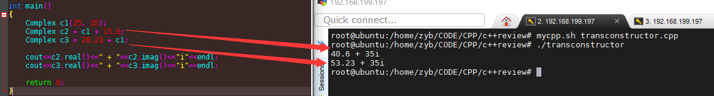

如上，Complex c2 = c1 + 15.6,则15.6被编译器转化为Complex类型的某个临时对象，在执行运算符+重载函数。

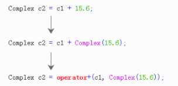


其次，一个重要的点，以上函数，发生了隐式转换，但是如果我们将此函数的友元声明去掉，将成员变量属性变为public的，使它作为类的成员函数。

~~~c
#include <iostream>
#include <cstring>

using namespace std;

class Complex{
public:
	Complex(): m_real(0.0),m_imag(0.0){ }
	Complex(double real,double imag):m_real(real),m_imag(imag){ }
	Complex(double real): m_real(real),m_imag(0.0){}

public:
	Complex operator+(const Complex &A);
	
public:
	double real() const { return m_real; }
	double imag() const { return m_imag; }
	
public:
	double m_real;
	double m_imag;
};


Complex Complex::operator+(const Complex &A)
{
	this->m_real += A.m_real;
	this->m_imag += A.m_imag;
	return *this;
}

int main()
{
	Complex c1(25, 35);
	Complex c2 = c1 + 15.6;
	//Complex c3 = 28.23 + c1;
	
	cout<<c2.real()<<" + "<<c2.imag()<<"i"<<endl;
	//cout<<c3.real()<<" + "<<c3.imag()<<"i"<<endl;
	
	return 0;
}
~~~

此时编译是通过的且达到了我们的目的，因为c++编译器进行了如下转换：

~~~c
c2 = c1+15.6; <==> c2 = c1.operator+(15.6); 
    		  <==> c2 = c1.operator+(Complex(15.6));
~~~

若此时在上述基础上，执行如下代码：

~~~c
int main()
{
	Complex c1(25, 35);
	//Complex c2 = c1 + 15.6;
	Complex c3 = 28.23 + c1;
	
	//cout<<c2.real()<<" + "<<c2.imag()<<"i"<<endl;
	cout<<c3.real()<<" + "<<c3.imag()<<"i"<<endl;
	
	return 0;
}
~~~

则编译失败，为什么？我们知道运算符+具有左结合性，而c++只会对**成员函数的参数**进行类型转化，而不会对**调用成员函数的对象**进行类型转换，即，**不会发生**如下转换：

~~~c
c3 = 28.23 + c1; <==> c3 = Complex(28.23).operator+(c1);//不会发生
~~~


这个例子，也充分显示，**使用成员函数形式的重载和使用全局函数形式的重载的重大区别：作为类的成员函数不能对称地处理数据。**


**2. 我们可以通过关键字explicit来阻止这这种隐式转换。**explicit只在类内使用。

~~~c
class Sales_data
{
  	Sales_data() = default;
    
    Sales_data(const std::string &s,unsigned n,double 	
               p):bookNO(S),unit_sold(n),reveue(p*n){}
    
    Sales_data(const std::string &s):bookNo(s){}
    
    explicit Sales_data(std::istream &);
};
~~~


**3. 不能将explicit构造函数用于拷贝形式的初始化过程**。

~~~c

~~~


#### 23. 拷贝、赋值、析构函数

**我们除了需要构造函数来初始化对象以外，当发生对象的拷贝、赋值、销毁动作时，我们也希望有对应的处理过程**

如果我们不显示地定义这三个过程，那么和构造函数一样，编译器会为我们定义这些默认过程。

如下，没有定义赋值过程，但是可以进行赋值。

~~~c
class Sales_data 
{
public:
	Sales_data() = default;
	Sales_data(int arga) {a = arga;}
	Sales_data(string& pstr):str(pstr) {cout<<str<<endl;}

public:
	int a = 10;
	string str{"default string"};
	Sales_data  &combine(const Sales_data &);
};

void class_assigment()
{
	string str("bbb");
	Sales_data sobj3(str);
	Sales_data sobj4;
	sobj4 = sobj3;
	cout<<sobj4.str<<endl;
}
~~~

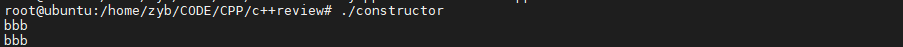


##### 1.拷贝

1.1 默认拷贝构造函数

**当类中没有定义拷贝构造函数时，编译器会默认提供一个拷贝构造函数，进行成员变量之间的拷贝。(这个拷贝操作是浅拷贝)**

##### 2.赋值


##### 3.析构

~~~c
#include <iostream>
#include <cstring>
using namespace std;

class String 
{
public:
	String(const char *str=NULL);
	String& operator = (const String& Other);
	String(const String& Other);
	~String();
	
	char *m_data = NULL;
};

//默认构造
String::String(const char *str)
{
	if (str == NULL)
	{
		m_data = new char[1];
		m_data[0] = '\0';
	}
	else 
	{
		int len = strlen(str);
		m_data = new char[len+1];
		strncpy(m_data,str,len);
		m_data[len] = '\0';
	}
}

String::~String()
{
	if (m_data != NULL)
	{
		delete [] m_data;
	}
}

//赋值构造
String& String::operator = (const String& Other)
{
	cout<<"赋值构造:"<<endl;
	if (this == &Other)
	{
		return *this;
	}
	
	delete [] m_data;
	int len = strlen(Other.m_data);
	m_data = new char[len+1];
	strcpy(m_data,Other.m_data);
	return *this;
}

int count = 0;

//拷贝构造
String::String(const String& Other)
{
	cout<<"拷贝构造:"<<++count<<endl;
	if (this != &Other)
	{
		if (m_data)
		{
			delete [] m_data;
		}
		
		int len = strlen(Other.m_data);
		m_data = new char[len+1];
		strcpy(m_data,Other.m_data);
	}
	else//自己给自己初始化时也要防止初始化失败
	{
		if (Other.m_data == NULL)
		{
			m_data = new char[1];
			m_data[0] = '\0';
		}
	}
}

int main()
{
	String str("abcdefghijklmnopqrstuvwxyz");
	String str2 = str;
    
	String str3;
	str3 = str2;
	printf("%s\n",str3.m_data);
	
	return 0;
}
~~~

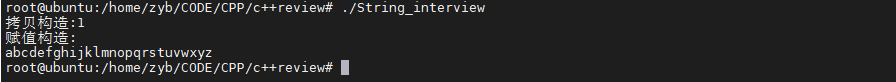

由上可知：

**(1). 拷贝构造函数是用一个对象初始化一块内存区域，这块内存就是新对象的内存区，而赋值函数是对于一个已经被初始化的对象来进行赋值操作。**


#### 24. 访问说明符

##### 24.1 private

private之后的成员只能被成员函数访问，这成员也包含成员函数。


#### 25. 友元（声明）

为什么会有友元？从上述我们知道，当我们将类中的部分成员对外隐藏，那么外部一些需要调用这些被隐藏了的成员就不再拥有使用他们的权限，那怎么办呢？只能将这些要访问类内私有的成员的函数声明为友元函数。

**友元函数声明只是权限的声明，而不是普通的函数声明**

##### 1.友元类

~~~c++
class A
{
    friend class B;//这样B就可以访问A的私有成员
private:
    ...
}
~~~


#### 26. OOP
##### 1. 封装
它描述了捆绑数据以及在一个单元（例如c++、java中的类）内处理该数据的方法的思想。
此概念还经常用于从外部隐藏对象的内部表示或状态。这称为信息隐藏。
这种机制的总体思路很简单。
如果您具有从对象外部看不到的属性，并将其与提供对它的读写访问权限的方法捆绑在一起，则可以隐藏特定信息并控制对对象内部状态的访问。

##### 2. 继承和对象模型相关专题

(a)

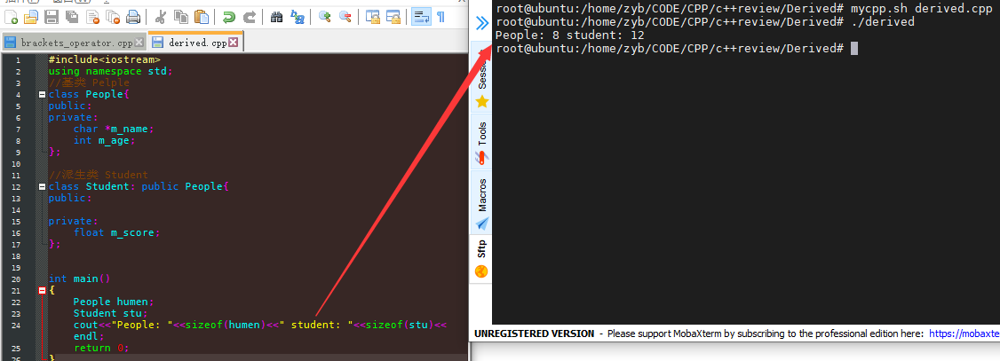

(b)

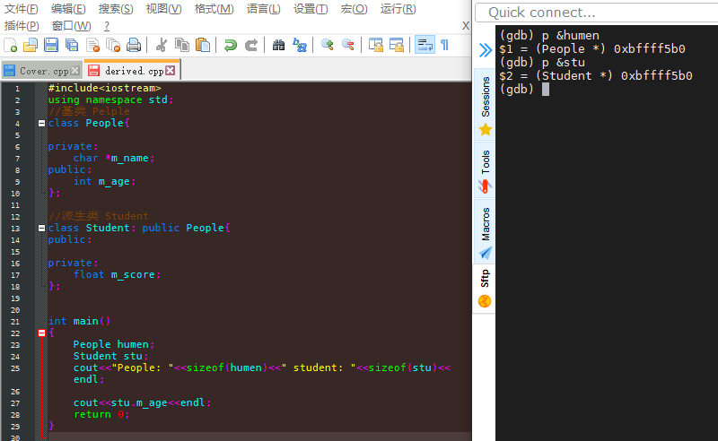

**（1）以上两张图初步反映了类具有继承关系时的内存模型**。


###### 1. 继承权限问题

**（1）基类成员在派生类中的访问权限不得高于继承方式中指定的权限。**

**（2）可以使用using关键字改变基类成员在派生类中的访问权限，仅限为public和private的成员**

~~~c
#include <iostream>
#include <cstring>
using namespace std;
class People{
public:
	People(int age,char *name);//:m_age(age);
	void show();
protected:
    char *m_name = NULL;
    int m_age;
};

void People::show()
{
	cout<<m_name<<"'s age is: "<<m_age<<endl;
}

People::People(int age,char *name):m_age(age),m_name()
{
	int len = strlen(name);
	m_name = new char[len+1];
	strncpy(m_name,name,len);
	m_name[len] = '\0';
}

class Student: public People{
public:
	Student(int age,float score,char *name):People(age,name),m_score(score){}
public:
    float m_score;
	using People::m_name;
	using People::m_age;
private:
	using People::show;
};

int main()
{
    People humen(40,"michael");
	Student stu(20,99.9,"lee");	
	humen.show();//OK
    stu.show();//ERROR
	return 0;
}
~~~

**（3）若派生类中具有与基类重名的成员，那么将覆盖原基类中继承而来的成员**

**（4）基类成员函数和派生类成员函数不会构成重载，如果派生类有同名函数，那么就会遮蔽基类中的所有同名函数，不管它们的参数是否一样，即，只有一个作用域内的同名函数才具有重载关系。**

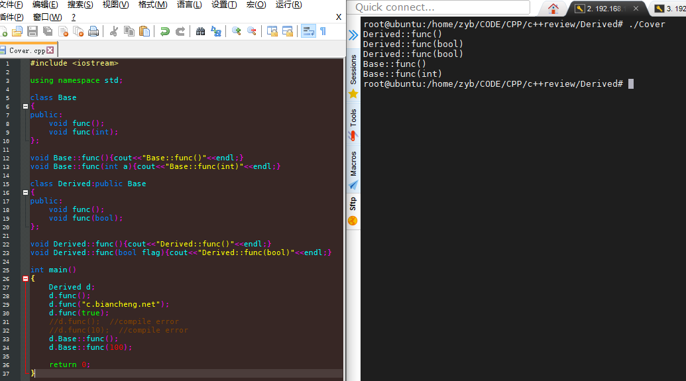


###### 2. c++类继承时作用域的嵌套

**（1）当存在继承关系时，派生类的作用域嵌套在基内的作用域中**

这个作用域，要抽象来理解，按照上面的说法，派生类的作用域嵌套在基类的作用域中，

那么基类就可以访问派生类的成员？不是，而是反之。

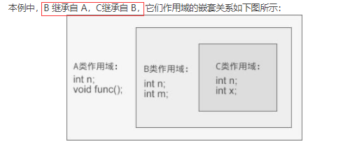

**（2）名字查找：在作用域链中寻找与所用名字最匹配的声明（或定义）的过程。**

#### 27. mutable

**可变数据成员**

我们有时候希望修改**一个类的某个数据成员**，即使在一个const成员函数内。

~~~c
#include <iostream>
using namespace std;
class Screen 
{
public:
	Screen(int count) {access_cstr = count;}
	void some_member() const;
	
private:
	mutable size_t access_cstr;
	int a = 10;
};

void Screen::some_member() const
{
	access_cstr++;
	//a++;				//error
	cout<<access_cstr<<endl;
}

int main()
{
	Screen sc(100);
	sc.some_member();
	return 0;
}
~~~

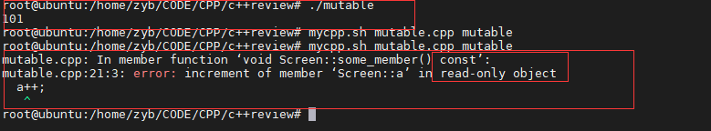


#### 28. 类的静态成员

**(1).  类的静态成员存在于任何对象之外，对象中不包含任何与静态数据成员有关的数据**

如下，输出结果为1，为空类大小，说明静态成员int a不属于该类。

~~~c
#include <iostream>
using namespace std;
class static_t
{
public:
private:
	static int a;
};
void size_static_test()
{
	cout<<sizeof(static_t)<<endl;
}

int main()
{
	size_static_test();
	return 0;
}
~~~

**(2). 静态成员函数也不与任何对象绑定在一起，他们不包含this指针。**

**(3). 当在类的外部定义静态成员时，不能重复使用static关键字,该关键字只出现在类内部的声明语句**

**(4). 我们不能在类的内部初始化静态成员，必须在类的外部定义和初始化每个静态成员。**


#### 29. extern c

某个头文件myfun.h,若它被引入cpp的工程文件中成为cpp代码的一部分，则extern "C"可以告知编译器,以处理 C 语言代码的方式来处理该C++ 代码。即，以C语言的方式来链接display( )函数。

~~~c
#ifdef __cplusplus__
extern "C" void display();
#else 
void display();
#endif
~~~

然而这又是为什么呢？因为cpp存在函数重载机制，cpp编译器在编译期间，会将重载的函数以“函数名_参数类型”的方式重新命名函数。所以链接阶段，如果是c编译的代码，而c++编译器去链接，它就可能找不到该符号，那么就造成链接失败。

~~~c
//extern.h
#ifndef __EXTERN__H__
#define __EXTERN__H__
int display(int a,int b);
#endif 
~~~

~~~c
//extern.c
#include <stdio.h>
#include "extern.h"

int display(int a,int b)
{
	printf("a: %d b: %d\n",a,b);
	return 0;
}
~~~

~~~c
//cpp_extern.cpp
#include "extern.h"
int main()
{
	display(10,20);
	
	return 0;
}
~~~


先编译出extern.o


再编译cpp_extern.c

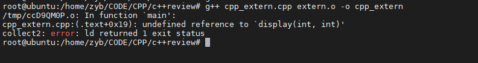

报错如上，因为编译cpp_extern.cpp的时候，g++会去找目标文件extern.o中查找display函数的符号，但是它是按照g++编译器的方式去找这个符号，等价于它找的是"display_int_int"这个函数，我们gcc编译出来的符号为"display",当然找不到了，于是就报错如上。

我们修改extern.h头文件如下，再次编译cpp_extern.cpp，就可以了，这个extern "C" ，将某个范围的代码明确要以c语言的方式来处理，这个处理对我们本次举例就是寻找和链接编译符号。

~~~c
#ifndef __EXTERN__H__
#define __EXTERN__H__

#ifdef __cplusplus
extern "C"{
#endif
	int display(int a,int b);
#ifdef __cplusplus	
}
#endif 
#endif 
~~~


#### 30. 异常

**异常一旦被try捕捉到，就不会再执行异常点后面的语句，也即是，检测到异常点后面程序的执行流会发生跳转，并且在try块内的语句就不再执行了。即便，catch语句成功地处理了错误，程序的执行流也不会再回退到异常点。**

异常检测机制是c++的一种代码运行时检测机制。我很疑问，既然能猜到这段代码运行时会发生异常，为何不将其优化避免产生异常呢？

~~~c
#include <iostream>
using namespace std;
void str_test(int idx)
{
	char ch2 = 0;
	string str("www.baidu.com");
	try{//try代码块中放置可能会在运行时产生异常的语句
		ch2 = str.at(idx);
	}catch(out_of_range)//catch处理类型确定的异常
	{
		idx = 0;
		ch2 = str.at(idx);
	}
    
	cout<<ch2<<endl;
}

int main()
{
	str_test(100);
	return 0;
}
~~~

##### 30.1 try语句和捕捉范围

~~~c
#include <iostream>
#include <initializer_list>
using namespace std;

void str_test(int idx)
{
	char ch2 = 0;
	string str("www.baidu.com");
	ch2 = str.at(idx);
	cout<<ch2<<endl;
}

void test1()
{
	str_test(100);
}

void test2()
{
	test1();
}

void test3()
{
	test2();
}

void try_pos()
{
	try{
		throw "unknow Exception";
		test3();
	}catch(const char* &e){
		cout<<e<<endl;
	}
}

int main()
{
	try_pos();
	return 0;
}
~~~

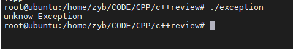

以上代码和输出，说明，try能捕捉到它的代码块内的所有调用关系的异常，是否，从堆栈的角度来看，try能检测到同一栈中的压住它的所有的代码指令范围的异常？


#### 31.运算符重载

##### 1.运算符重载是通过函数实现的，它本质上是函数重载

~~~c
#include <iostream>
#include <cstring>

using namespace std;

class complex{
public:
	complex();
	complex(double real,double imag);
	complex operator+(const complex &A) const;
	void operator=(const complex &A);
	void display() const;
private:
	double m_real;
	double m_imag;
};

complex::complex():m_real(0.0),m_imag(0.0){}

complex::complex(double real,double imag):m_real(real),m_imag(imag)
{
	cout<<"the model: "<<this<<endl;
	cout<<"real: "<<real<<" "<<"imag: "<<imag<<endl;
	cout<<endl;
}

#if 0
complex complex::operator+(const complex &A) const
{
	complex B;
	B.m_real = this->m_real + A.m_real;
	B.m_imag = this->m_imag + A.m_imag;
	
	return B;
}
#else
complex complex::operator+(const complex &A)const{
    return complex(this->m_real + A.m_real, this->m_imag + A.m_imag);
}

#endif

void complex::operator=(const complex &A)
{
	cout<<"operator=(const complex &A)"<<endl;
    this->m_real = A.m_real;
	this->m_imag = A.m_imag;
	return;
}

void complex::display() const 
{
	cout<<m_real<<" + "<<m_imag<<"i"<<endl;
}


int main()
{
	complex c1(4.3, 5.8);
	complex c2(2.4, 3.7);
	complex c3;
	c3 = c1 + c2;//<==> c1.operator+(c2);
	c3.display();
	cout<<"c1: "<<&c1<<endl;
	cout<<"c2: "<<&c2<<endl;
	cout<<"c3: "<<&c3<<endl;
	
	return 0;
}
~~~

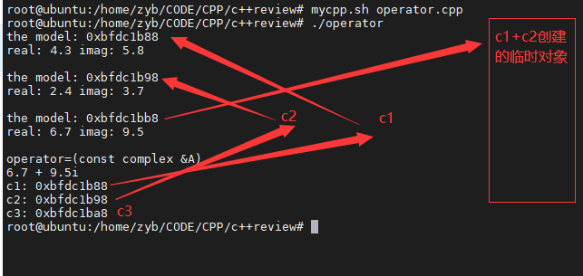

以上代码，重载了运算符'+'和'='号，所以才能完成：c3 = c1+c2;

~~~c
c3 = c1+c2;
等价于:
c3.operator=(c1.opeartor+(c2));
即，完成c1和c2的对象通过重载的加号运算符相加，产生的临时对象，再通过重载的赋值运算符，赋值给c3。
~~~

##### 2. 运算符重载函数不仅可以作为类的成员函数，还可以作为全局函数

~~~c
class complex
{
 public:
    ...
	friend complex opeartor+(const complex &A,const complex &B);
};

//在全局范围内重载+
complex opeartor+(const complex &A,const complex &B)
{
    complex C;
    C.m_real = A.m_real + B.m_real;
    C.m_imag = A.m_imag  + B.m_imag;
    return C;
}
~~~


##### 3. 运算符重载时要遵循的规则

3.1 不能被重载的运算符

运算符|名称
-|-
sizeof|长度运算符
:?|条件运算符
.|成员选择符
::|域解析运算符

3.2 重载不能改变运算符的优先级和结合性.

​	c4 = c1 + c2 * c3; <==> c4 = c1 + ( c2 * c3 );

3.3 重载不会改变运算符的用法，原有有几个操作数、操作数在左边还是右边，这些都不会改变.

3.4 只能以成员函数的形式重载的操作符.

|操作符|name|
|-|-|
|->||
|[]||
|()|类型强制转换运算符|
|=||


#### 32. 动态内存和智能指针

##### 1. shared_ptr

##### 2. weak_ptr


### 2. c++对象模型

#### 1. 没有继承时的对象内存分布情况


#### 2. 继承时的内存模型

~~~c
#include <iostream>
using namespace std;

class A
{
public:
	A(int a,int b);
	void display();
public:
	int m_a;
    int m_b;
};

A::A(int a,int b):m_a(a),m_b(b){ }
void A::display()
{
	cout<<"m_a= "<<m_a<<" m_b= "<<m_b<<endl;
	cout<<endl;
}

class B:public A
{
public:
	B(int a,int b,int c);
	void display();
public:
	int m_c;
};
B::B(int a,int b,int c):A(a,b),m_c(c){ }

void B::display()
{
	cout<<"m_a= "<<m_a<<" m_b= "<<m_b<<" m_c= "<<m_c<<endl;
	cout<<endl;
}

class C:public B
{
public:
	C(int a,int b,int c,int d);
	void display();
public:
	int m_d;
};
C::C(int a,int b,int c,int d):B(a,b,c),m_d(d){ }

void C::display()
{
	cout<<"m_a= "<<m_a<<" m_b= "<<m_b<<" m_c= "<<m_c<<" m_d= "<<m_d<<endl;
	cout<<endl;
}

class D
{
	;
};

int main()
{
	A obj_a(2,22);
	obj_a.display();
	
	cout<<"obj_a: "<<&obj_a<<endl;
	cout<<"obj_a.m_a: "<<&obj_a.m_a<<endl;
	cout<<"obj_a.m_b: "<<&obj_a.m_b<<endl;
	cout<<endl;
	cout<<endl;
	
	B obj_b(3,33,333);
	obj_b.display();
	obj_b.A::display();
	
	cout<<"obj_a: "<<&obj_a<<endl;
	cout<<"obj_b: "<<&obj_b<<endl;
	cout<<"obj_b.m_a: "<<&obj_b.m_a<<endl;
	cout<<"obj_b.m_b: "<<&obj_b.m_b<<endl;
	cout<<"obj_b.m_c: "<<&obj_b.m_c<<endl;
	cout<<endl;
	cout<<endl;
	
	C obj_c(1,11,111,1111);
	obj_c.A::display();
	obj_c.B::display();
	obj_c.display();
	
	cout<<"obj_a: "<<&obj_a<<endl;
	cout<<"obj_b: "<<&obj_b<<endl;
	cout<<"obj_c: "<<&obj_c<<endl;
	cout<<"obj_c.m_a: "<<&obj_c.m_a<<endl;
	cout<<"obj_c.m_b: "<<&obj_c.m_b<<endl;
	cout<<"obj_c.m_c: "<<&obj_c.m_c<<endl;
	cout<<"obj_c.m_d: "<<&obj_c.m_d<<endl;
	
	return 0;
}
~~~

如上代码，C继承B,B继承A，输出每一个对象及其成员变量的虚拟内存地址并加以整理，如下：

~~~c
obj_a: 0xbfc43668
obj_a.m_a: 0xbfc43668
obj_a.m_b: 0xbfc4366c

obj_b: 0xbfc43670
obj_b.m_a: 0xbfc43670
obj_b.m_b: 0xbfc43674
obj_b.m_c: 0xbfc43678

obj_c: 0xbfc4367c
obj_c.m_a: 0xbfc4367c
obj_c.m_b: 0xbfc43680
obj_c.m_c: 0xbfc43684
obj_c.m_d: 0xbfc43688
~~~

说明有继承时的内存模型如下:

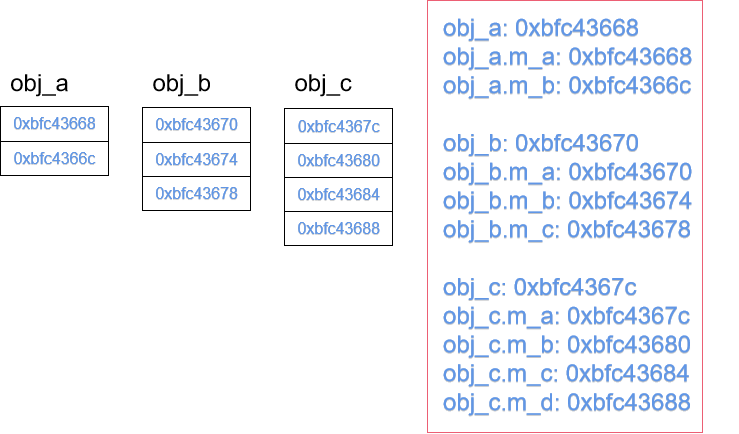

#### 3. 有成员变量遮蔽时的内存分布

将类C修改为如下：

~~~c
class C:public B
{
public:
	C(int a,int b,int c,int d);
	void display();
public:

	int m_b;//覆盖A类的变量m_b
	int m_c;//覆盖B类的变量m_c
	int m_d;
};
~~~


此时内存模型如下：

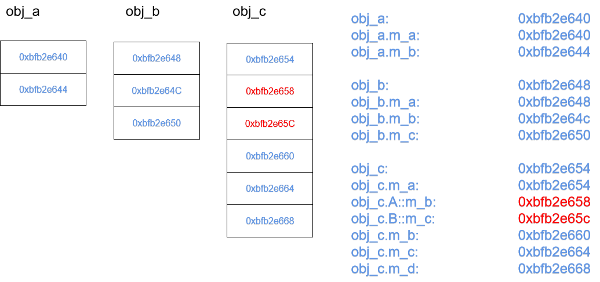

由以上两个模型，可知，当基类 A、B 的成员变量被遮蔽时，**仍然会留在派生类对象 obj_c 的内存中**，C 类新增的成员变量**始终排在基类 A、B 的后面。**

#### 4. C++基类和派生类的构造函数

**（1）类的构造函数不能被继承**，因为即使被继承了，他的名字和派生类的名字也不一样，更不能成为派生类的构造函数，当然更不能成为普通的成员函数。

**（2）对于派生类来说，他所继承的基类的私有变量，无法访问和初始化，只能通过调用基类的构造函数**来初始化。

**（3）派生类构造函数中，只能调用直接基类的构造函数，不能调用间接基类的构造函数。**因为，如果c调用b又调用a的构造函数，则b又会调用a的构造函数，那么a的构造函数就被调用了两次了。

**（4）通过派生类创建对象时，必须要调用基类的构造函数，如果不指明调用哪一个，就调用基类的默认构造函数**


#### 5. C++基类和派生类的析构函数有

**析构函数也不能被集成，派生类在调用析构函数时不需要调用基类的析构函数，因为析构函数唯一，编译器知道怎么去调用**

#### 6. 多重继承

~~~c
class C:public A,public B
{
    
};
~~~

**（1）若此时A、B中有同名变量，若不指定作用域名，则编译器不知道使用哪一个变量而报错**

~~~c
#include <iostream>
using namespace std;

class A
{
public:
	A(int a,string &name);
	void display();
public:
	int m_a;
	string samename;
};

A::A(int a,string &name):m_a(a),samename(name){ }
void A::display()
{
	cout<<"m_a= "<<m_a<<endl;
	cout<<"name= "<<samename<<endl;
	cout<<endl;
}

class B
{
public:
	B(int b,string &name);
	void display();
public:
	int m_b;
	string samename;
};

B::B(int b,string &name):m_b(b),samename(name){ }

void B::display()
{
	cout<<"m_b= "<<m_b<<endl;
	cout<<"name= "<<samename<<endl;
	cout<<endl;
}

class C:public A,public B
{
public:
	C(int a,int b,int c,string &nameA,string& nameB);
	void display();
public:
	int m_c;
};

C::C(int a,int b,int c,string &nameA,string& nameB):A(a,nameA),B(b,nameB),m_c(c){ }

void C::display()
{
	cout<<"m_c= "<<m_c<<endl;
	cout<<endl;
}

int main()
{
	string nameA = "AAA";
	string nameB = "BBB";
	
	A obj_a(41,nameA);
	obj_a.display();
	cout<<"obj_a: "<<&obj_a<<endl;
	cout<<"obj_a.m_a: "<<&obj_a.m_a<<endl;
	cout<<"obj_a.samename: "<<&obj_a.samename<<endl;
	cout<<endl;
	cout<<endl;
	
	
	B obj_b(42,nameB);
	obj_b.display();
	cout<<"obj_b: "<<&obj_b<<endl;
	cout<<"obj_b.m_b: "<<&obj_b.m_b<<endl;
	cout<<"obj_b.samename: "<<&obj_b.samename<<endl;
	cout<<endl;
	cout<<endl;
	
	C obj_c(3,1,2,nameA,nameB);
	obj_c.display();
	cout<<"obj_c: "<<&obj_c<<endl;
	cout<<"obj_c.m_c: "<<&obj_c.m_c<<endl;
	cout<<endl;
	cout<<endl;
	
	cout<<"obj_c.m_a "<<&obj_c.m_a<<endl;
	cout<<"obj_c.m_b: "<<&obj_c.m_b<<endl;
    
	cout<<"obj_c.samename: "<<&obj_c.samename<<endl;//error:request for member ‘samename’ is ambiguous
	
	return 0;
}
~~~

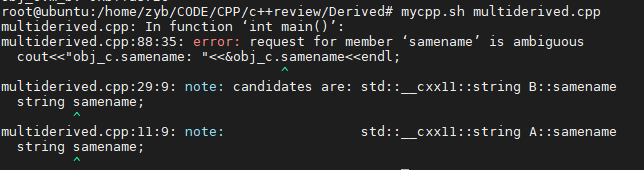

修改为如下:

~~~c
//cout<<"obj_c.samename: "<<&obj_c.samename<<endl;//error:request for member ‘samename’ is ambiguous
cout<<"obj_c.A::samename: "<<obj_c.A::samename<<endl;
cout<<"obj_c.B::samename: "<<obj_c.B::samename<<endl;

cout<<"obj_c.A::samename: "<<&obj_c.A::samename<<endl;
cout<<"obj_c.B::samename: "<<&obj_c.B::samename<<endl;
~~~

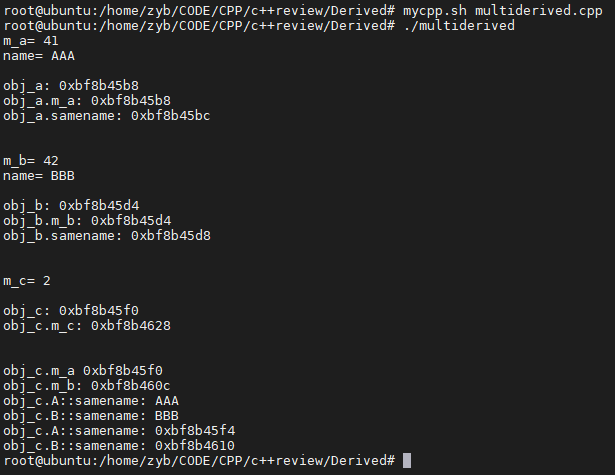

整理以上变量的存储地址，得到其内存模型如下：

​	


可以看出，其C类的对象中各继承而来的成员变量和自己的成员变量的顺序**和继承时的顺序相同。**

#### 7. 虚继承和虚基类详解（以菱形继承为例）

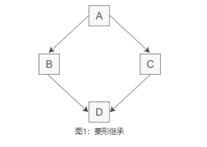


此时，A中的成员变量和成员函数继承到D中变成了两份。

~~~c
#include <iostream>
using namespace std;

class A
{
public:
	A(int a);
	void display();
public:
	int m_a;
};

A::A(int a):m_a(a){cout<<"A()"<<endl;}
void A::display()
{
	cout<<"m_a= "<<m_a<<endl;
	cout<<endl;
}

class B:public A
{
public:
	B(int a,int b);
	void display();
public:
	int m_b;
};

B::B(int a,int b):A(a),m_b(b){}

void B::display()
{
	cout<<"m_a= "<<m_a<<endl;
	cout<<"m_b= "<<m_b<<endl;
	cout<<endl;
}

class C:public A
{
public:
	C(int a,int c);
	void display();
public:
	int m_c;
};

C::C(int a,int c):A(a),m_c(c){ }

void C::display()
{
	cout<<"m_a= "<<m_a<<endl;
	cout<<"m_c= "<<m_c<<endl;
	cout<<endl;
}


class D:public B,public C
{
public:
	D(int a,int b,int c,int d);
	void display();
public:
	int m_d;
};

D::D(int a,int b,int c,int d):B(a,b),C(a,c),m_d(d){ }

void D::display()
{
	cout<<"m_a= "<<m_a<<endl;
	cout<<"m_b= "<<m_b<<endl;
	cout<<"m_c= "<<m_c<<endl;	
	cout<<"m_d= "<<m_d<<endl;
	cout<<endl;
}

int main()
{
	return 0;
}
~~~

如上菱形继承，编译报错如下：m _a 具有二义性

这是由于**编译器不知道m_a是来自A->B->D分支还是A->C->D分支。**

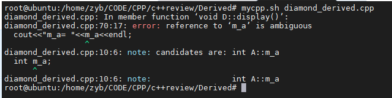

基于这个问题，c++提出了虚继承，虚继承使得在派生类中**只保留一份间接基类的成员。**


**(1). 虚继承的目的是让某个类做出声明，承诺愿意共享它的基类,这个被共享的基类就称为虚基类（Virtual Base Class）**


虚继承如下：

~~~c
class B:virtual public A
{
	...
};
...
class C:virtual public A
{
    ...
};
~~~

这样就能让B、C声明他们愿意共享他们的基类A,然而还是**不能编译通过**.详情请看c++虚继承时的构造函数。

**虚派生的产生是定义了类D以后才生成的，然而虚派生是声明在虚基类的派生类上，那么就要求，虚派生不影响派生类本身，它只影响从指定了虚基类的派生类中进一步派生出来的类。**

**虚基类成员的可见性**


#### 8. c++虚继承时的构造函数

**（1）在虚继承中，虚基类是由最终的派生类初始化的，即，最终派生类的构造函数必须要调用虚基类的构造函数。这和普通继承的构造函数的调用不同！**

这也就是第6节的代码，在声明为虚继承后还是编译不通过的原因。

~~~c
class D:public B,public C
{
public:
	D(int a,int b,int c,int d):B(a,b),C(a,c),m_d(d){ }
	void display()
	{
		cout<<"m_a= "<<m_a<<endl;
		cout<<"m_b= "<<m_b<<endl;
		cout<<"m_c= "<<m_c<<endl;	
		cout<<"m_d= "<<m_d<<endl;
		cout<<endl;
	}
	
public:
	int m_d;
};
~~~

编译失败：

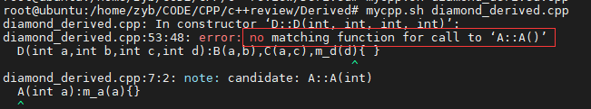


就是因为最终派生类没有调用虚基类的构造函数导致。

~~~c
class D:public B,public C
{
public:
	D(int a,int b,int c,int d):A(a),B(a,b),C(a,c),m_d(d){ }//增加了A(a)
	void display()
	{
		cout<<"m_a= "<<m_a<<endl;
		cout<<"m_b= "<<m_b<<endl;
		cout<<"m_c= "<<m_c<<endl;	
		cout<<"m_d= "<<m_d<<endl;
		cout<<endl;
	}
	
public:
	int m_d;
};
~~~

这是因为，B、C都继承自A,如果由B、C像普通继承那样来调用A的构造函数对继承而来的成员变量，那么B、C给出不同的实参，编译器就不知道该怎么调A。所以采用虚继承后，c++就规定直接由最终派生类来调用虚基类的构造函数。

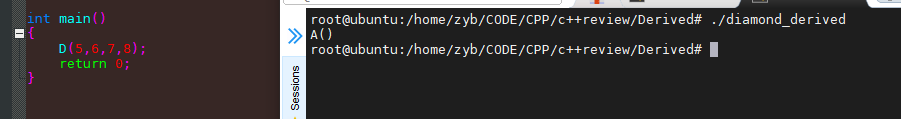

看，虽然D调用了B、C的构造函数，按照普通继承，B和C也会调用A的构造函数，但是在虚继承中没有发生。


#### 9. 虚继承下的内存模型

##### 1. 虚基类表

如果某个派生类有一个或多个虚基类，编译器就会在**派生类对象**中安插一个指针，指向虚基类表，虚基类表是一个偏移数组，数组中的元素存放的是继承自各个虚基类成员的偏移。

**（1）**

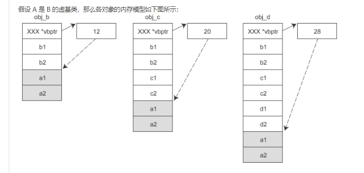虚


**（2）**

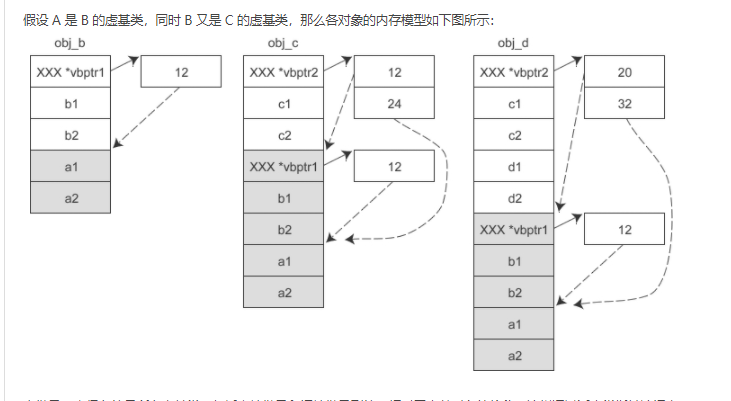


**（3）**


### 3. C++标准库(STL)

#### 1. STL组成


#### 2. STL类型分布


#### 3. 容器通用操作

##### 3.1 容器定义和初始化

##### 3.2 容器赋值和交换

##### 3.3 容器大小操作

##### 3.4 容器比较

##### 3.5


~~~c
#include <iostream>
#include <vector>
#include <list>
#include <algorithm>

using namespace std;

int main()
{
	// sequence container
	vector<int> v;
	v.push_back(100);
	v.push_back(20);
	v.push_back(400);
	v.push_back(50);
	
	//当v为list时，不能使用sort，因为List is bidirection iterator
	//sort的迭代器时随即访问的：Random access Iterators，而list为双向迭代器
	sort(v.begin(),v.end());

	//iterator are similar to pointers...
	auto itr =v.begin();
	
	for (;itr != v.end();itr++)
	{
		cout<<"val: = > "<<*itr<<endl;
	}
	
	cout<<"Size => "<< v.size()<<endl;
	
	v.clear();
	
	cout<<"Size => "<< v.size()<<endl;
	
	return 0;
}
~~~

**当v为list时，不能使用sort，因为List is bidirection iterator，**

**sort的迭代器是随机访问的：Random access Iterators，而list为双向迭代器**


~~~c
#include <iostream>
#include <vector>
#include <list>
#include <algorithm>

using namespace std;

int main()
{
	// sequence container
	int arr[] = {100,20,300,45,55};
	int *begin = &arr[0];
	int *end = &arr[0] + (sizeof(arr)/sizeof(arr[0]));
	
	
	sort(begin,end);
	//iterator are similar to pointers...
	
	for (;begin != end;begin++)
	{
		cout<<"val: = > "<<*begin<<endl;
	}
	
	return 0;
}

~~~

执行结果如图：


所以，我们可知：**iterator are similar to pointers.**


#### 4. map

~~~C
#include <map>
~~~


~~~c
#include <iostream>
#include <map>

using namespace std;

int main()
{
	//pair：创建方式1
	pair<int,int> p = make_pair(10,20);
	cout<<p.first<<" - "<<p.second<<endl;
	
	map<int,int> mp;
	mp[4] = 400;//pair：创建方式2
	mp[3] = 300;
	
	mp.insert(make_pair(10,100));
	mp[7] = 700;
	
	//iterate 
	for (auto it = mp.begin();it != mp.end();it++)
	{
		cout<<it->first<<"------"<<it->second<<endl;
	}
	
	return 0;
}
~~~


**重要！我们没有给其按照特定顺序创建，但是输出是顺序的，这就是map与unordered_map的关系**

**sort by the key**


~~~c
#include <iostream>
#include <map>

using namespace std;

int main()
{
	//pair：创建方式1
	pair<int,int> p = make_pair(10,20);
	cout<<p.first<<" - "<<p.second<<endl;
	
	map<int,int> mp;
	mp[4] = 400;//pair：创建方式2
	mp[3] = 300;
	
	mp.insert(make_pair(10,100));
	mp.insert(make_pair(10,700));//
	mp[7] = 700;
	
	//iterate 
	for (auto it = mp.begin();it != mp.end();it++)
	{
		cout<<it->first<<"------"<<it->second<<endl;
	}
	
	return 0;
}
~~~


如上，当使用mp.insert( )插入（10，700）的时候，输出的还是之前已插入的（10，100）,这是因为insert()函数当发现key=10已存在，那么此操作就舍弃。


~~~c
#include <iostream>
#include <map>

using namespace std;

int main()
{
	//pair：创建方式1
	pair<int,int> p = make_pair(10,20);
	cout<<p.first<<" - "<<p.second<<endl;
	
	map<int,int> mp;
	mp[4] = 400;//pair：创建方式2
	mp[3] = 300;
	
	mp.insert(make_pair(10,100));
	mp[10] = 700;
	
	//iterate 
	for (auto it = mp.begin();it != mp.end();it++)
	{
		cout<<it->first<<"------"<<it->second<<endl;
	}
	
	return 0;
}
~~~


而当使用mp[10] = 700;时，却能够修改key=10的value.


#### 5. multimap
~~~c
#include <iostream>
#include <map>

using namespace std;

int main()
{
	multimap<int,int> mp;
	mp.insert(make_pair(4,400));
	mp.insert(make_pair(10,700));
	mp.insert(make_pair(3,300));
	mp.insert(make_pair(10,900));
	mp.insert(make_pair(10,1000));
	
	//iterate 
	for (auto it = mp.begin();it != mp	.end();it++)
	{
		cout<<it->first<<"------"<<it->second<<endl;
	}
	
	return 0;
}
~~~


**上图所示，multimap和map比对起来看，差异就是key可以一对多**


**又一图，说明,multimap中key和map是任意对应关系的，只要插入就存在**，那么这个数据结构，很可能会在某些死循环里造成堆栈溢出。


#### 6. unordered_map

~~~C
#include <iostream>
#include <map>

#include <unordered_map>

using namespace std;

int main()
{
	unordered_map<int,int> mp;
	mp.insert(make_pair(4,400));
	mp[4] = 400;
	mp[3] = 300;
	
	mp.insert(make_pair(4,300));
	mp.insert(make_pair(10,700));
	mp.insert(make_pair(3,400));
	mp.insert(make_pair(21,900));
	mp.insert(make_pair(11,1000));
	mp[10] = 900;
	
	
	//iterate 
	for (auto it = mp.begin();it != mp	.end();it++)
	{
		cout<<it->first<<"------"<<it->second<<endl;
	}
	
	return 0;
}
~~~


由以上程序和执行结果，我们可知，**在unorder_map中，键值对是唯一的**。insert()同样不能插入已经存在的key，而可以使用元素下标方式修改某个key所映射的值。

其次，**unordered_map是无序的，且输出顺序和pair创建顺序无关.**


#### 7. vector

erase();

~~~c
#include <iostream>
#include <vector>
#include <algorithm>

using namespace std;

int main()
{
	vector<int> v;
	v.push_back(10);
	v.push_back(20);
	v.push_back(30);
	v.push_back(40);
	v.push_back(50);
	v.push_back(60);
	v.push_back(70);
	v.push_back(80);
	v.push_back(90);
	v.push_back(100);
	
	v.erase(v.begin() + 3,v.begin() + 4);
	v.erase(v.begin() + 3,v.end() - 1);
	
	for (auto &var:v)
	{
		cout<<"vector var ==>"<<var<<endl;
	}
	
	return 0;
}
~~~


remove();

~~~c
#include <iostream>
#include <vector>
#include <algorithm>

using namespace std;

int main()
{
	vector<int> v;
	v.push_back(10);
	v.push_back(20);
	v.push_back(30);
	v.push_back(40);
	v.push_back(50);
	v.push_back(60);
	v.push_back(70);

	std::remove(v.begin(),v.end(),40);//删除vector v中某个范围的值为40的元素
	
	
	for (auto &var:v)
	{
		cout<<"vector var ==>"<<var<<endl;
	}
	
	return 0;
}
~~~

**删除vector v中某个范围的值为40的元素**


erase

~~~c
#include <iostream>
#include <vector>
#include <algorithm>

using namespace std;

int main()
{
	vector<int> v;
	v.push_back(10);
	v.push_back(20);
	v.push_back(30);
	v.push_back(40);
	v.push_back(50);
	v.push_back(60);
	v.push_back(70);

	cout<<"Size of vector before remove ==>"<<v.size()<<endl;
	auto iterbegin = std::remove(v.begin(),v.end(),40);
	cout<<"Size of vector after remove ==>"<<v.size()<<endl;
	v.erase(iterbegin,v.end());
	cout<<"Size of vector after erase ==>"<<v.size()<<endl;
	
	
	for (auto &var:v)
	{
		cout<<"vector var ==>"<<var<<endl;
	}
	
	return 0;
}
~~~


如上图程序和执行结果，**remove移除了元素，但是元素空间并未释放，而erase()擦除元素后元素空间被释放了。**

#### 8. set

~~~c
#include <iostream>
#include <map>
#include <set>

using namespace std;

int main()
{
	map<int,string> mymap;
	set<int> myset;
	
	myset.insert(100),myset.insert(200),myset.insert(40),myset.insert(90),myset.insert(200);
	
	for (auto &setval:myset)
	{
		cout<<setval<<endl;
	}
	
	return 0;
}
~~~


上述结果所示，：

**（1）set也是维护元素有序的**

**（2）set也是唯一的**

#### 9. multiset

~~~c
#include <iostream>
#include <map>
#include <set>
using namespace std;

int main()
{
	map<int,string> mymap;
	multiset<int> myset;	myset.insert(100),myset.insert(200),myset.insert(40),myset.insert(90),myset.insert(200);
	myset.erase(200);//(1)
    myset.erase(myset.begin());//(2)
	for (auto &setval:myset)
	{
		cout<<setval<<endl;
	}
	
	return 0;
}
~~~


#### 10. STL comparators

##### less \<\> & greater \<\>

~~~c
#include <iostream>
#include <map>
#include <set>

using namespace std;

int main()
{
	//set<int> myset;//(1)
	//set<int,greater<int>> myset;//(2)
	set<int,less<int>> myset;//(3)
	myset.insert(40),myset.insert(20),myset.insert(30);
	
	for (auto &elem:myset)
	{
		cout<<elem<<" - "<<endl;
	}
	
	return 0;
}
~~~


以上输出，分别只添加（1）、（2）、（3）的结果如上。


~~~c
#include <iostream>
#include <map>
#include <set>

using namespace std;

int main()
{
	map<int,string,greater<int>> mymap;
	mymap[10] = "abc";
	mymap[30] = "def";
	mymap[20] = "xyz";
	
	for (auto &elem:mymap)
	{
		cout<<elem.first<<" - "<<elem.second<<endl;
	}
	cout<<endl;
	
	set<int,less<int>> myset;//(3)
	myset.insert(40),myset.insert(20),myset.insert(30);
	
	for (auto &elem:myset)
	{
		cout<<elem<<" - "<<endl;
	}
	
	return 0;
}
~~~


~~~c
#include <iostream>
#include <map>
#include <set>

using namespace std;

template <typename type>
struct mycomp{
	bool operator()(const type & first,const type & second) const {
		return first > second;
	}
};

int main()
{
	//set<pair<int,int>> myset;//（1）
	//set<pair<int,int>,greater<pair<int,int>>> myset;//(2）
	set<pair<int,int>,mycomp<pair<int,int>>> myset;//(3）
	
	myset.insert({40,10}),myset.insert({20,100}),myset.insert({30,250});
	
	for (auto &elem:myset)
	{
		cout<<elem.first<<" - "<<elem.second<<endl;
	}
	
	return 0;
}
~~~


分别执行（1）、(2）、(3）的结果如上所示。


~~~c
template <typename type>
struct mycomp{
	bool operator()(const type & first,const type & second) const {
		return first.second > second.second;//修改为比较pair中的值
	}
};
~~~

代码中，比较函数修改为比较pair中的值，此时输出：


#### 11. container adapter

##### Stack、Queue、Priority_Queue

###### 11.1 stack

~~~c
#include <functional>
#include <iostream>
#include <vector>
#include <list>
#include <stack>
#include <queue>

using namespace std;

int main()
{
	//stack<int> cstk;
	//stack<int,deque<int>> cstk;
	stack<int,vector<int>> cstk;
	cstk.push(100);
	cstk.push(200);
	cstk.push(300);
	
	while(!cstk.empty())
	{
		cout<<cstk.top()<<endl;
		cstk.pop();
	}

	return 0;
}
~~~


如上，声明一个栈结构，可显式地指明使用何种数据结构来实现。**这种应该是程序员出于特定的目的，避免编译器进行默认选择的不是程序员需要的。**


###### 11.2 queue

~~~c
#include <functional>
#include <iostream>
#include <vector>
#include <list>
#include <stack>
#include <queue>

using namespace std;

int main()
{
	queue<int> cstk;
	
	cstk.push(100);
	cstk.push(200);
	cstk.push(300);
	
	while(!cstk.empty())
	{
		//cout<<cstk.top()<<endl;
		cout<<cstk.front()<<endl;
		cout<<cstk.back()<<endl;
		cout<<endl;
		cstk.pop();
	}

	return 0;
}
~~~

执行结果：


~~~c
#include <functional>
#include <iostream>
#include <vector>
#include <list>
#include <stack>
#include <queue>

using namespace std;

int main()
{
	//queue<int> cstk;//(1)
	//queue<int,deque<int>> cstk;//(2)
	//queue<int,list<int>> cstk;//(3)
	queue<int,vector<int>> cstk;//(4) 编译失败
	cstk.push(100);
	cstk.push(200);
	cstk.push(300);
	
	while(!cstk.empty())
	{
		//cout<<cstk.top()<<endl;
		cout<<cstk.front()<<endl;
		//cout<<cstk.back()<<endl;
		cstk.pop();
	}

	return 0;
}
~~~


如上，只有声明为vector时编译失败，也即是不支持vector作为底层实现的数据结构，这是因为vector不支持pop_front（）函数。


###### 11.3 priority_queue

**数据按照优先级顺序存储在队列中**

~~~c
#include <functional>
#include <iostream>
#include <vector>
#include <list>
#include <stack>
#include <queue>

using namespace std;

int main()
{
	priority_queue<int> cstk;
	
	cstk.push(100);
	cstk.push(30);
	cstk.push(400);
	cstk.push(129);
	cstk.push(30);
	cstk.push(400);
	cstk.push(129);
	
	while(!cstk.empty())
	{
		cout<<cstk.top()<<endl;
		cstk.pop();
	}

	return 0;
}

~~~

输出结果：


**可以看到，入队顺序和入队时间无关，而和元素大小正相关，说明优先级队列默认的优先级类型为元素大小。**


~~~c
#include <functional>
#include <iostream>
#include <vector>
#include <list>
#include <stack>
#include <queue>

using namespace std;

int main()
{
	//priority_queue<int,vector<int>,greater<int>> cstk;//(1)
    priority_queue<int,vector<int>,less<int>> cstk;//(2)
	cstk.push(100);
	cstk.push(30);
	cstk.push(400);
	cstk.push(129);
	cstk.push(540);
	
	while(!cstk.empty())
	{
		cout<<cstk.top()<<endl;
		cstk.pop();
	}

	return 0;
}
~~~

设置不同优先级得到不同的输出：


###### 11.4 deque


#### 12. array


#### 13. iterator

##### 13.1 反向迭代器

name|含义
:-|:-
reverse_iterator|按逆序寻址元素的迭代器
const_reverse_iterator|
c.rbegin(),  c.rend()|返回指向c的尾元素和首元素之前位置的迭代器
c.crbegin(),  c.crend()|


#### 14. Functional Programing with Map(),Filter()  & Reduce()

##### 函数式编程

~~~c
#include <iostream>
#include <forward_list>
#include <algorithm>
#include <numeric>
#include <vector>

using namespace std;

//Functional Programing with Map(),Filter() &Reduce()
int main()
{
	//map - transform 
	vector<int> v {1,2,3,4,5,6,7};
	vector<int> vout(v.size());
	transform(v.begin(),v.end(),vout.begin(),[](int & value){return value * 3;});
	for (auto &val : vout)
	{
		cout<<val<<endl;
	}
	return 0;
}
~~~


示例2：


另一种转换方式：

~~~c
#include <iostream>
#include <forward_list>
#include <algorithm>
#include <numeric>
#include <vector>

using namespace std;


//Functional Programing with Map(),Filter() &Reduce()
int main()
{
	//map - transform 
	vector<int> v {1,2,3,4,5,6,7};
	vector<int> vout;
	
	transform(v.begin(),v.end(),back_inserter(vout),[](int & value){return value * 3;});

	for (auto &val : vout)
	{
		cout<<val<<endl;
	}
	
	return 0;
}
~~~


##### 14.1 filter

~~~c
#include <iostream>
#include <forward_list>
#include <algorithm>
#include <numeric>
#include <vector>

using namespace std;

//Functional Programing with Map(),Filter() &Reduce()
int main()
{
	//map - transform 
	vector<int> v {1,2,3,4,5,6,7};
	vector<int> vout;
	//map
	transform(v.begin(),v.end(),back_inserter(vout),[](int & value){return value * 3;});

	
	//filter
	vector<int>::iterator endfilter = remove_if(vout.begin(),vout.end(),[](int &value){
		if (value % 2 == 0){
			return true;
		}else {
			return false;
		}
	});
	
	for (auto itr = vout.begin();itr != endfilter;itr++)
	{
		cout<<*itr<<endl;
	}
	
	return 0;
}
~~~


##### 14.2 reduce

~~~c
#include <iostream>
#include <forward_list>
#include <algorithm>
#include <numeric>
#include <vector>

using namespace std;


//Functional Programing with Map(),Filter() &Reduce()
int main()
{
	//map - transform 
	vector<int> v {1,2,3,4,5,6,7};
	vector<int> vout;
	
	//map
	transform(v.begin(),v.end(),back_inserter(vout),[](int & value){return value * 3;});

	
	//filter
	vector<int>::iterator endfilter = remove_if(vout.begin(),vout.end(),[](int &value){
		if (value % 2 == 0){
			return true;
		}else {
			return false;
		}
	});
	
	for (auto itr = vout.begin();itr != endfilter;itr++)
	{
		cout<<*itr<<endl;
	}
	
	//reduce
	int finaval = accumulate(vout.begin(),endfilter,0,[](int first,int second){ return first + second;});
	cout<<"Finaval value: "<<finaval<<endl;
	
	return 0;
}
~~~


#### 15. Allocators

**Using Custom Allocators**

~~~c
#include <cstddef>
#include <iostream>
#include <vector>
#include <new>

using namespace std;

template<typename type>
struct MyAlloc : allocator<type> {
	type * allocate(size_t size){
		cout<<" Allocation request size ==> "<<size<<endl;
		return new type[size];
	}
	
	void deallocation(type &ptr,size_t size){
		cout<<"Deallocation size ==> "<<size<<endl;
		delete [] ptr;
	}
};

int main()
{
	vector<int, MyAlloc<int> > v1;
	v1.push_back(10);
	
	cout<<"size: "<<v1.size()<<endl;
	
	v1.push_back(20);
	v1.push_back(30);
	v1.push_back(40);
	v1.push_back(50);
	
	cout<<"size: "<<v1.size()<<endl;
	
	for (auto &val : v1)
	{
		cout<<val<<endl;
	}
	
	return 0;
}
~~~

以上自定义了一个内存分配器，但是不知道为啥没有生效？？？


